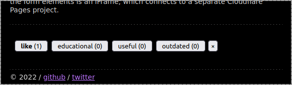

# ActivityHub

ActivityHub is a service I used to provide some degree of dynamic functionality to
my [statically generated blog](https://github.com/crookm/blog). It consist of two pieces: the service API, and the
frontend.

## Overview

### API

The service API is a gRPC application written using .NET, which handles some simple requests for data out of an SQLite
database.

It is not intended to be scaled beyond a single instance, as migrations are applied during startup to save deployment
effort.

### Frontend

The frontend is a Blazor WebAssembly application, which hosts all of the UI. It is intended to be a micro-frontend, in
which it is designed to be embedded as an iframe in my blog.
